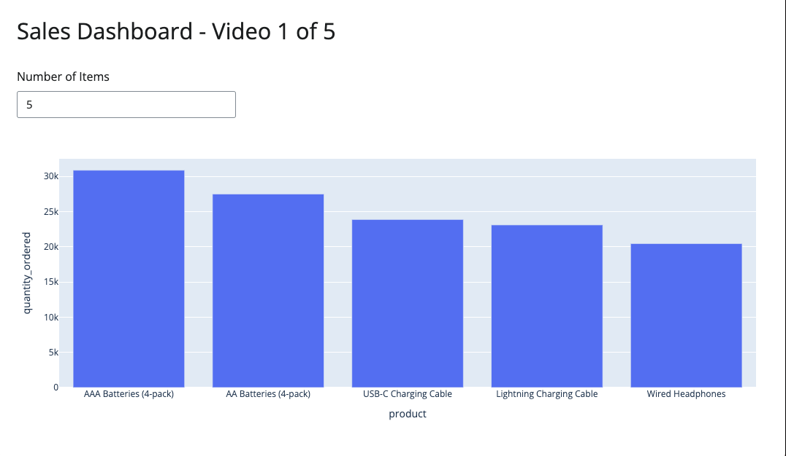
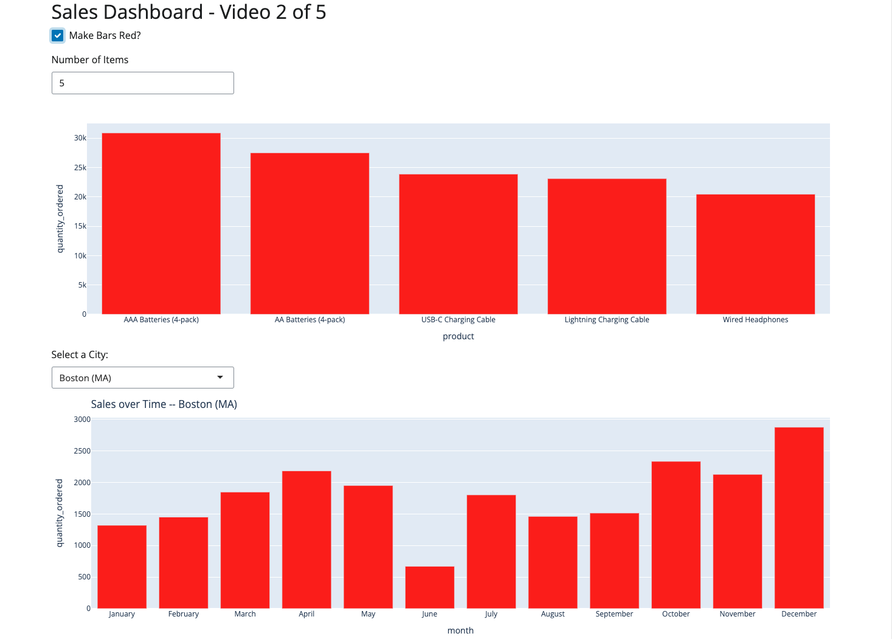
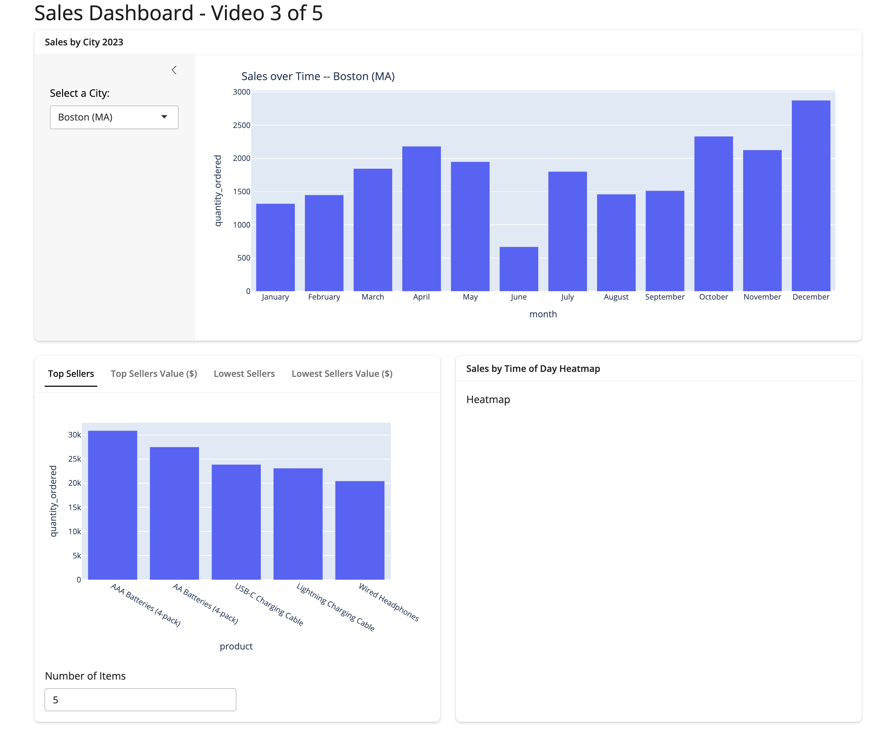
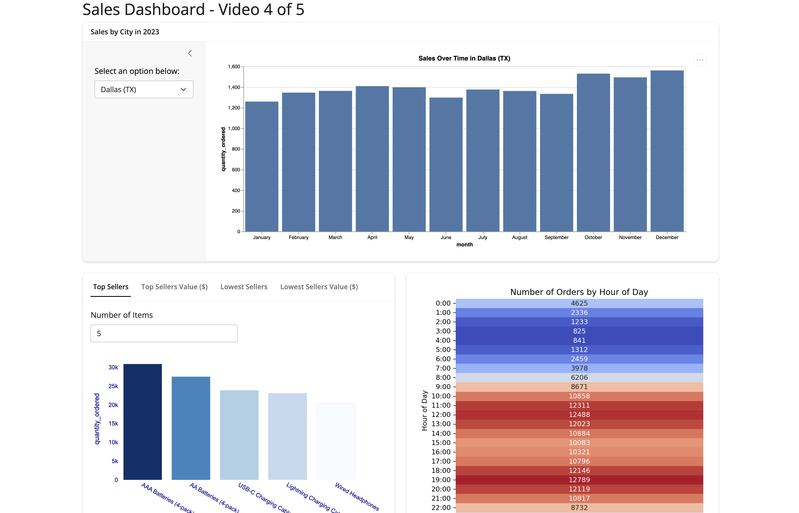

# Shiny Python Projects
Python projects built using the Shiny Framework

## Sales Dashboard Project

[Sales Dashboard Project](./sales)

Given 12 months of (mock) sales data from an electronics store, what type of Shiny application can we build?

This project walks through the basics of Shiny, how reactivity works, how to customize your application layout, and more. This is a great place to start if you are new to Shiny.

### Part 1: How to Build, Deploy, & Share a Python Application in 20 Minutes

Walks through the basics of getting started with Shiny for Python and we build
and deploy a simple app by the end of the video.

[Finished Source Code](https://github.com/KeithGalli/shiny-python-projects/tree/video1/sales)

[Video Link](https://youtu.be/I2W7i7QyJPI?si=4gQSbdKbF50SX3uO)

### Part 2: How to Make Interactive Python Dashboards! (Reactivity in Shiny)

Walks through the important concept of reactivity in Shiny and how we can add
and manage the interactivity of our Python applications.

[Finished Source Code](https://github.com/KeithGalli/shiny-python-projects/tree/video2/sales)

[Video Link](https://youtu.be/SLkA-Z8HTAE?si=DE0xSYtlJ0ym6lw8)

### Part 3: How to make your Python Dashboard look Professional! (Layouts in Shiny)

We focus on enhancing the visual appeal and structure of your Shiny dashboards
using various layout components.

[Finished Source Code](https://github.com/KeithGalli/shiny-python-projects/tree/video3/sales)

[Video Link](https://www.youtube.com/watch?v=dQw4w9WgXcQ)

### Part 4: How to combine Matplotlib, Plotly, Seaborn, and more in a single Python Dashboard!

We show how we can render various types of visualizations within Shiny.

[Finished Source Code](https://github.com/KeithGalli/shiny-python-projects/tree/video4/sales)

[Video Link](https://youtu.be/dQw4w9WgXcQ?si=0JJvt-tTj68fna4i)
